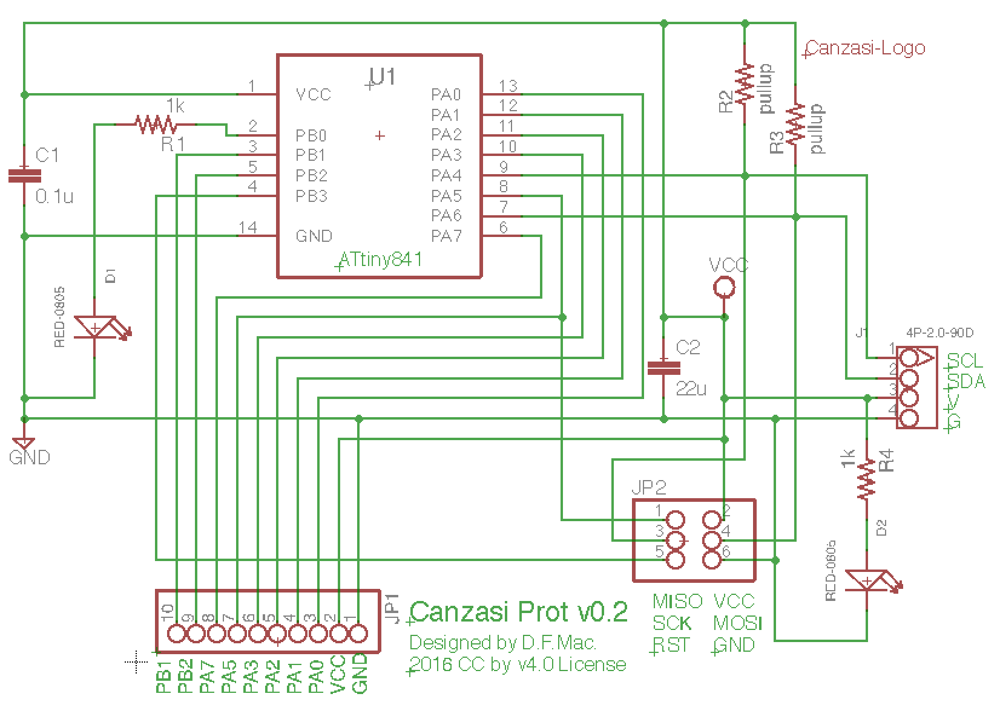
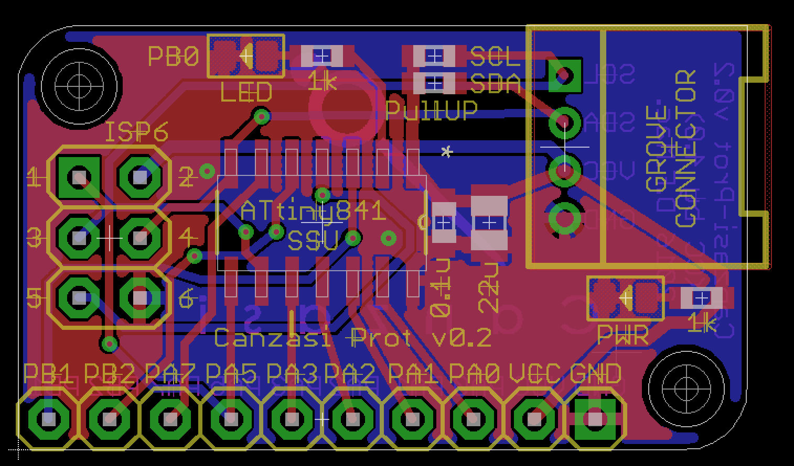
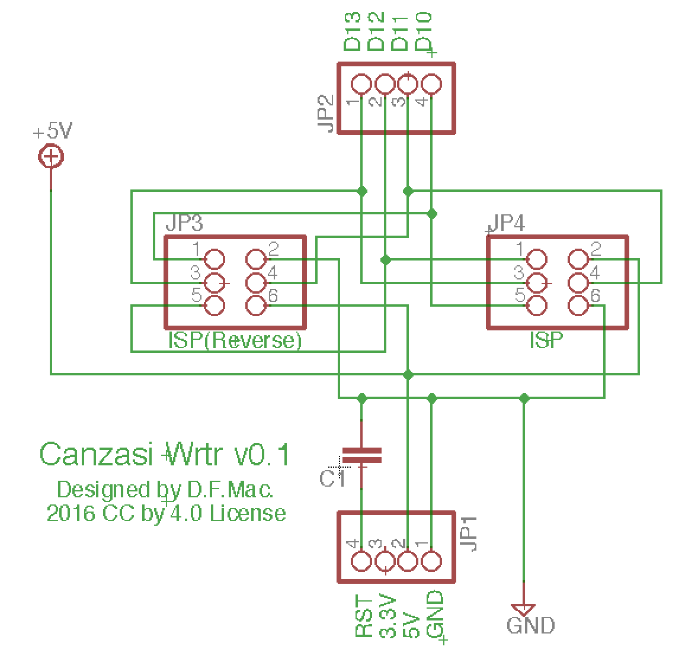

# Canzasi

「Canzasi」（かんざし）はArduinoを使ってI2C Slaveデバイスを試作するためのボードです。

# boards

## Canzasi-Prot

ATtiny841を採用した「Canzasi」最初のプロトタイプボードです。
Arduino IDEからISP経由での書き込みに対応しています。

### Concept

- Arduino IDE対応（ISP Programming）
- GROVEコネクタ
- ブレッドボードフレンドリー（1列GPIO）

### Design Data (v0.2)

[eagle files (v0.2)](./boards/Prot/v0.2/eagle/)

## Canzasi-Wrtr

Canzasi-Protにプログラムを書き込むためのArduino UNO用シールドです。

### Concept

- ミニマル
- Canzasi-Protとの接続にケーブル不要

### Design Data (v0.1)

[eagle files (v0.1)](./boards/Wrtr/v0.1/eagle/)

> v0.2に不具合 (#7) が見つかったため、一時的にstableをv0.1に戻しています。

## CHRMN-SimpleShield (v0.2)

Canzasiを搭載しいたCHIRIMEN用のシールドです。
外部に2つのGPIOしか出ていないこともあり、本ボードではATtiny841より安価なATtiny441を採用しています。

[!simpleshield](./boards/SimpleShield/simpleshield.jpg)

T.B.D.

# examples

## [blink](./examples/blink/Canzasi_blink/Canzasi_blink.ino)

Canzasi用のLチカです。
これは単なるLチカで、I2Cデバイスではありません。

## [simpleAnalogDevice](./examples/simpleAnalogDevice/Canzasi/Canzasi_I2CAnalogDevice/Canzasi_I2CAnalogDevice.ino)

Masterからのread要求を受けてADC (10bit)の値を返すサンプルです。    
simpleAnalogDeviceを利用するマスターデバイスのサンプルコードはこちら（[Arduino用](./examples/simpleAnalogDevice/Master/Arduino/I2C_MasterWordReader/I2C_MasterWordReader.ino)）です。

## [simpleButtonDevice](./examples/simpleButtonDevice/Canzasi/Canzasi_I2CDataProvider/Canzasi_I2CDataProvider.ino)

Masterからのread要求を受けてButtonが押されているかどうかを返すサンプルです。    
simpleButtonDeviceを利用するマスターデバイスのサンプルコードはこちら（[Arduino用](./examples/simpleButtonDevice/Master/Arduino/I2C_MasterReader/I2C_MasterReader.ino)）です。

## [simpleLedDevice](./examples/simpleLedDevice/Canzasi/Canzasi_I2Cblink/Canzasi_I2Cblink.ino)

Masterからのwriteデータを受けてLEDの点灯と消灯を行うサンプルです。    
simpleLedDeviceを利用するマスターデバイスのサンプルコードはこちら（[Arduino用](./examples/simpleLedDevice/Master/Arduino/I2C_MasterWriter/I2C_MasterWriter.ino)）です。

## [combined_4_Analog_1](./examples/combined_4_Analog_1/Canzasi/Canzasi_combined_4_Analog_1/Canzasi_combined_4_Analog_1.ino)

4つのアナログボリューム（可変抵抗）を接続したデバイスです。
Masterからのwrite 1byte（4つのアナログボリュームのどの値を返すかを指定）の後にSRを経由した Read 1byteに対応して8bitのアナログボリュームのデータを返します。

combined_4_Analog_1を利用するマスターデバイスのサンプルコードはこちら（[CHIRIMEN用](./examples/combined_4_Analog_1/Master/chirimen/)）です。

## [combined_4_Analog_2](./examples/combined_4_Analog_2/Canzasi/Canzasi_combined_4_Analog_2/Canzasi_combined_4_Analog_2.ino)

4つのアナログボリューム（可変抵抗）を接続したデバイスです。
Masterからのwrite 1byte（4つのアナログボリュームを2つづつのセットにして、グループA、Bどちらの値を返すかを指定）の後にSRを経由した Read 2byteに対応して8bitのアナログボリューム2つ分のデータを返します。

combined_4_Analog_2を利用するマスターデバイスのサンプルコードはこちら（[CHIRIMEN用](./examples/combined_4_Analog_2/Master/chirimen/)）です。

# Licence

 このリポジトリで公開するプログラムソースコードやハードウエア設計情報は <a rel="license" href="http://creativecommons.org/licenses/by/4.0/">クリエイティブ・コモンズ 表示 4.0 国際 ライセンスの下に提供されています。</a>
